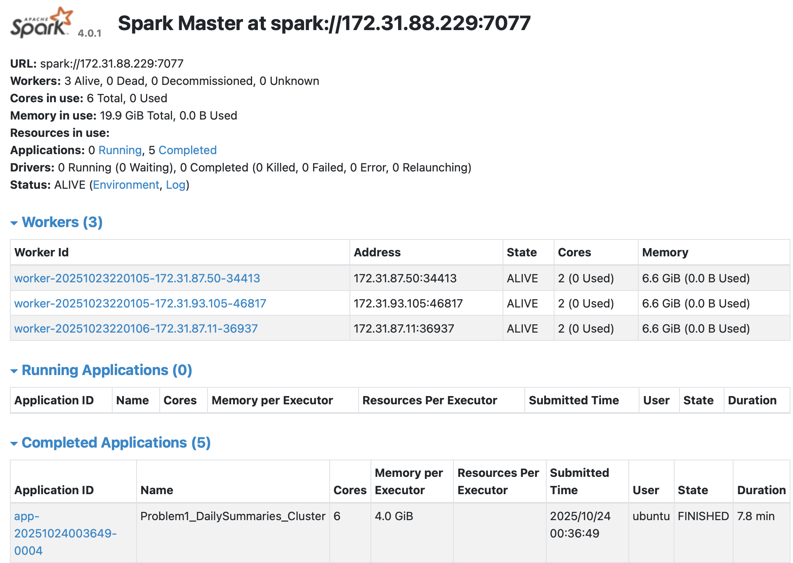

# 1. Approach of each question

## p1: 

I first use sample data for test. Since cluster runing on whole set could be time consuming and messy.

### p1.1

I grouped the data, sorted with count and download data as csv

### p1.2

select required column, order by random and limit to 10 to output csv

### p1.3

This part requred a printed text. Thus i extracted required variable and write them to txt

## p2

### p2.1

First extract all column need in p2, use withColumn, then groupby and extract data.

### p2.2

same as above

### p2.3

This part requred a printed text. Thus i extracted required variable and write them to txt

### p2.4

A simple barchart with count of app of each cluster, use pandas df transfered from spark df after grouped

### p2.5

First i calc the duration of every application use p2.1 result. Then i apply log space to on x to handle skewed duration data. Then i use kde histplot to draw the distribution of applications.

# Key Finding

The data have only three log level, not four. And most of it is INFO.
Most data have a range of time runing within 10000 sec?
For 6 clusters in dataset, most of application is in one cluster.
Duration of application in the cluster with most applications is left screwed

# Performance observations

Unfortunately, I stored the image of cluster runing of first problem in ec2 instance and it crashed in last week, resulting the png of p1 performance loss. But i remember i taked 4 min to finish first question in whole dataset.

For problem 2, see . I use 8 min total to finish the whole dataset.